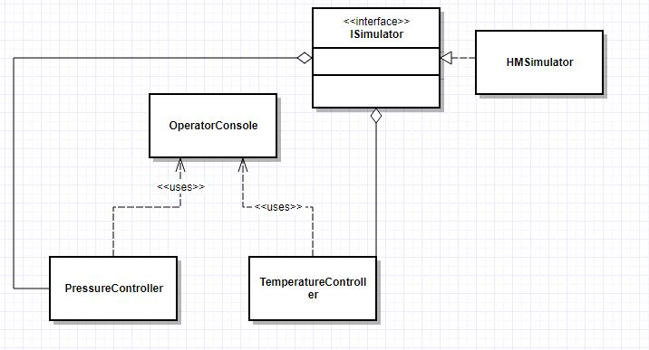

# HW3 - Implementing Plant system on Real Time System

HASAN MEN - 131044009

## [How to install Real Time Kernel patch on Linux(Ubuntu 16.04)](https://hmenn.github.io/pages/UbuntuRT_patch.html)

## HOW TO USE CLASSES- Requirements:
1. Create your Simulator which implements ISimulator
2. Set pressure and temperature work interval from CONSTANTS.h then construct PressureController and TemperatureController
3. Construct OperatorConsole to see results on console. Pressure and Temperature will send save/update request end of their work interval
4. When you construct OperatorConsole, it will print values to console.
5. Please check main.cpp to see calling orders

  

### PressureController
1. You can set A,B values which exist in PressureController.hpp to set pressure sensitivity.

### TemperatureController
1. You can set C(min),D(max) values which exist in TemperatureController.hpp to set min, max temperature.

### Test scenarious
1. Temperature: On the start-up temperature is 0. System will check this value and set on state to heater.
   Then temperature will be increased until reach min value of temperature. After that my system will take value between min,max values.

2. Pressure: Pressure is 0 on the start-up. System will calculate new pressure value to save value in range. An simulator will update this value slowly.

### HOW TO START APP
1. Compile files
~~~
make
~~~
2. Run as root for scheduling threads
~~~
sudo ./main
~~~

### HOW TO SEE SCHEDULED THREADS IN LUNUX
1. Find process pid
~~~
ps -a
~~~
2. Print process and thread informations with ps.(4046 is example pid)
~~~
ps -o pid,rtprio,command -m 4046
~~~
3. Sample output:
~~~
  PID RTPRIO COMMAND
 4046      - ./main
    -      - -
    -      - -
    -     10 -
    -     10 -
~~~
As you can see there is 2 threads which their priority 10.
